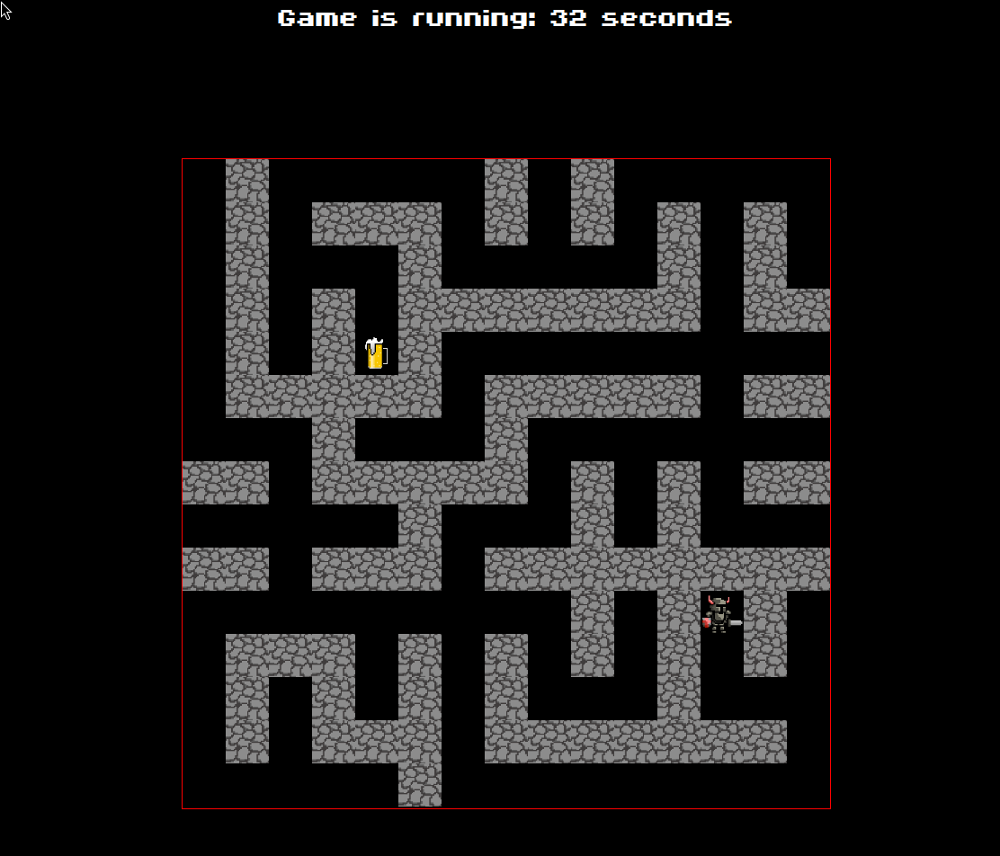

# maze-game
Introduction to cloud computing project
# 🍻 Welcome to the Beer Quest Game! 🍻

## 🚀 Technologies Used

### Frontend (Branch: `main`)
- HTML
- CSS
- JavaScript
- Phaser JS Framework
- Hosted on AWS Amplify

### Backend (Branch: `backend`)
- Node.js
- Express Framework
- Hosted on AWS EC2

## 🎮 How to Play
Click [here](https://main.dw2uffzoq9fxk.amplifyapp.com/) to start playing the game!

## 📜 Rules of the Game

1. 🕒 Each new game starts at every full minute.
2. 🎮 The character is controlled by the `W`, `A`, `S`, `D` buttons.
3. 🚧 You can't go through the blocked field marked by the wall icon.
4. 🍺 Your task is to reach the end point marked by the beer icon.
5. ⏱️ After 45 seconds, a break lasting 15 seconds begins, during which a table with the results of the players is shown.

## 📸 Example Screenshots

### Main Game Screen

Enjoy the game and may the best player win! 🍻
